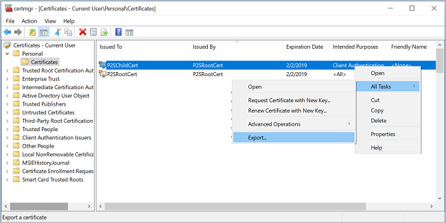
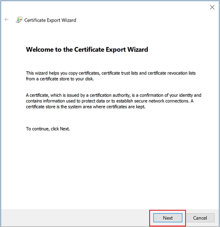
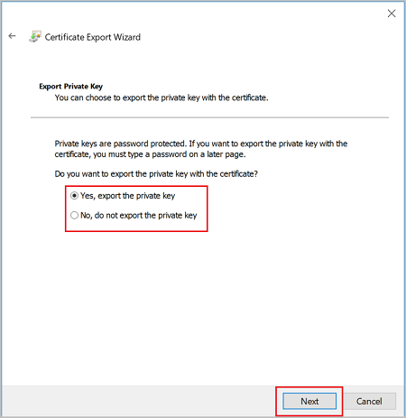
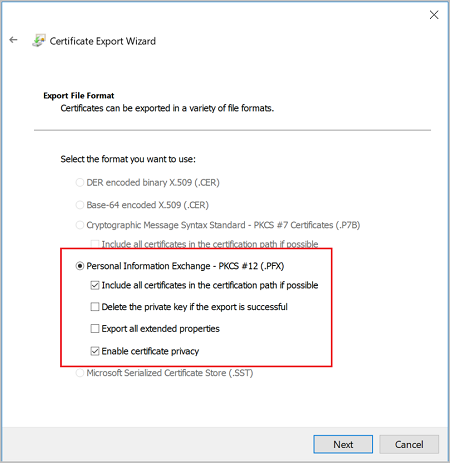
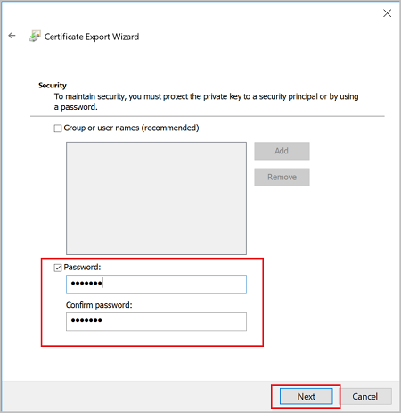
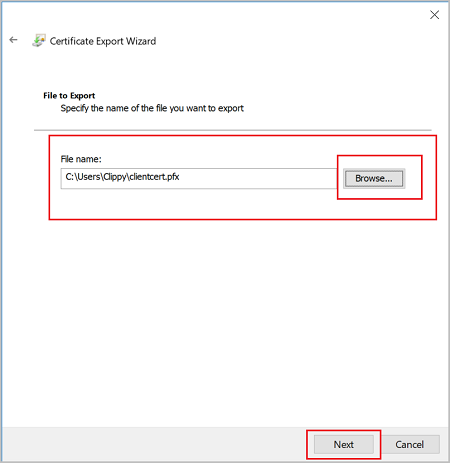

When you generate a client certificate, it's automatically installed on the computer that you used to generate it. If you want to install the client certificate on another client computer, you need to export the client certificate that you generated.

1. To export a client certificate, open **Manage user certificates**. The client certificates that you generated are, by default, located in 'Certificates - Current User\Personal\Certificates'. Right-click the client certificate that you want to export, click **all tasks**, and then click **Export** to open the **Certificate Export Wizard**.

   
2. In the Certificate Export Wizard, click **Next** to continue.

   
3. Select **Yes, export the private key**, and then click **Next**.

   
4. On the **Export File Format** page, leave the defaults selected. Make sure that **Include all certificates in the certification path if possible** is selected. This setting additionally exports the root certificate information that is required for successful client authentication. Without it, client authentication fails because the client doesn't have the trusted root certificate. Then, click **Next**.

   
5. On the **Security** page, you must protect the private key. If you select to use a password, make sure to record or remember the password that you set for this certificate. Then, click **Next**.

   
6. On the **File to Export**, **Browse** to the location to which you want to export the certificate. For **File name**, name the certificate file. Then, click **Next**.

   
7. Click **Finish** to export the certificate.

   