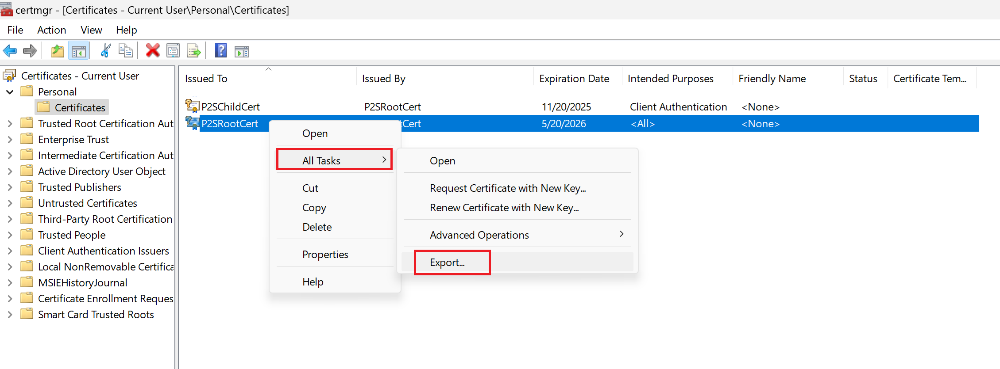
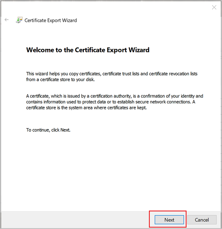
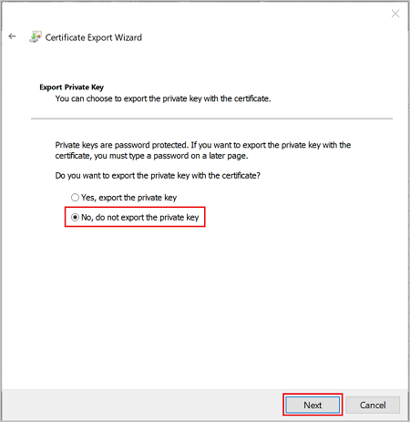
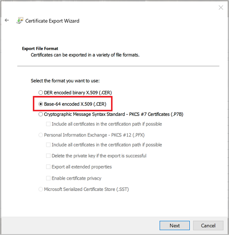
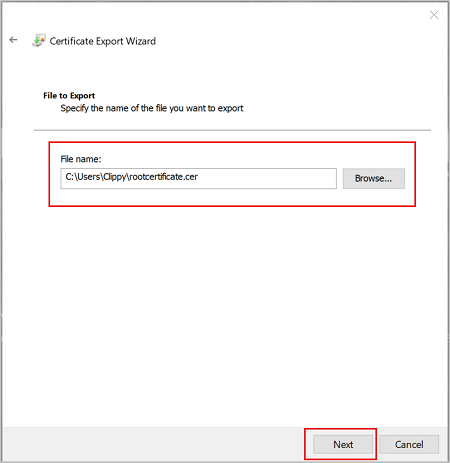
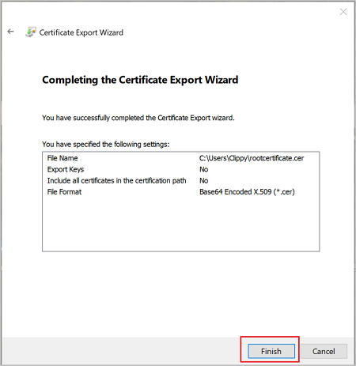
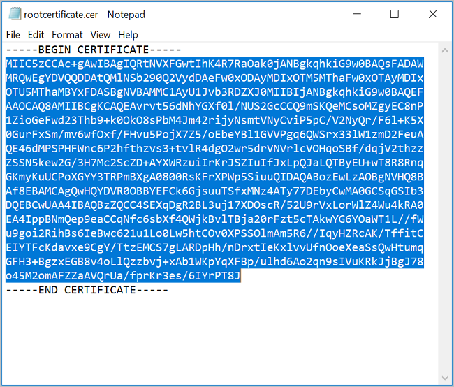

After creating a self-signed root certificate, export the root certificate public key .cer file (not the private key). You will later upload this file to Azure. The following steps help you export the .cer file for your self-signed root certificate:

1. To obtain a .cer file from the certificate, open **Manage user certificates**. Locate the self-signed root certificate, typically in 'Certificates - Current User\Personal\Certificates', and right-click. Click **All Tasks**, and then click **Export**. This opens the **Certificate Export Wizard**. If you can't find the certificate under Current User\Personal\Certificates, you may have accidentally opened "Certificates - Local Computer", rather than "Certificates - Current User"). If you want to open Certificate Manager in current user scope using PowerShell, you type *certmgr* in the console window.

   
2. In the Wizard, click **Next**.

   
3. Select **No, do not export the private key**, and then click **Next**.

   
4. On the **Export File Format** page, select **Base-64 encoded X.509 (.CER).**, and then click **Next**.

   
5. For **File to Export**, **Browse** to the location to which you want to export the certificate. For **File name**, name the certificate file. Then, click **Next**.

   
6. Click **Finish** to export the certificate.

   
7. Your certificate is successfully exported.

   
8. The exported certificate looks similar to this:

   
9. If you open the exported certificate using Notepad, you see something similar to this example. The section in blue contains the information that is uploaded to Azure. If you open your certificate with Notepad and it does not look similar to this, typically this means you did not export it using the Base-64 encoded X.509(.CER) format. Additionally, if you want to use a different text editor, understand that some editors can introduce unintended formatting in the background. This can create problems when uploaded the text from this certificate to Azure.

   
