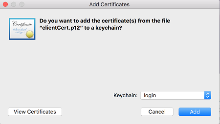
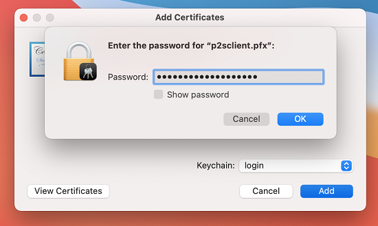

When installing a client certificate, you need the password that was created when the client certificate was exported.

1. Locate the .pfx certificate file and copy it to your Mac. You can get the certificate to the Mac in several ways, for example, you can email the certificate file.
2. After the certificate copied to the Mac, double-click the certificate to open the **Add Certificates** box, the click **Add** to begin the install.

   
3. Enter the password that you created when the client certificate was exported. The password protects the private key of the certificate. Click **OK** to complete the installation.

   