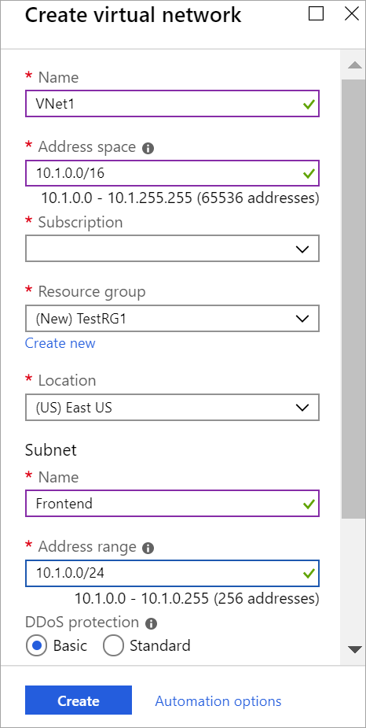

To create a VNet in the Resource Manager deployment model by using the Azure portal, follow the steps below. Use the **Example values** if you are using these steps as a tutorial. If you are not doing these steps as a tutorial, be sure to replace the values with your own. For more information about working with virtual networks, see the [Virtual Network Overview](../articles/virtual-network/virtual-networks-overview.md).

>[!NOTE]
>In order for this VNet to connect to an on-premises location you need to coordinate with your on-premises network administrator to carve out an IP address range that you can use specifically for this virtual network. If a duplicate address range exists on both sides of the VPN connection, traffic does not route the way you may expect it to. Additionally, if you want to connect this VNet to another VNet, the address space cannot overlap with other VNet. Take care to plan your network configuration accordingly.
>

1. From the [Azure portal](https://portal.azure.com) menu, select **Create a resource**. 

   
2. In the **Search the marketplace** field, type 'virtual network'. Locate **Virtual network** from the returned list and click to open the **Virtual Network** page.
3. Click **Create**. This opens the **Create virtual network** page.
4. On the **Create virtual network** page, configure the VNet settings. When you fill in the fields, the red exclamation mark becomes a green check mark when the characters entered in the field are valid. Use the following values:

   - **Name**: VNet1
   - **Address space**: 10.1.0.0/16
   - **Subscription**: Verify that the subscription listed is the one you want to use. You can change subscriptions by using the drop-down.
   - **Resource group**: TestRG1 (click **Create new** to create a new group)
   - **Location**: East US
   - **Subnet**: Frontend
   - **Address range**: 10.1.0.0/24

   
5. Leave DDoS as Basic, Service endpoints as Disabled, and Firewall as Disabled.
6. Click **Create** to create the VNet.