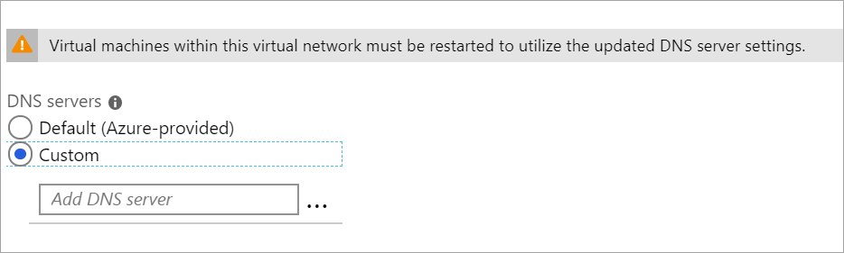

1. On the **Settings** page for your virtual network, navigate to **DNS Servers** and click to open the **DNS servers** page.

    

   - **DNS Servers:** Select **Custom**.
   - **Add DNS server:** Enter the IP address of the DNS server that you want to use for name resolution.

2. When you are done adding DNS servers, click **Save** at the top of the page.
