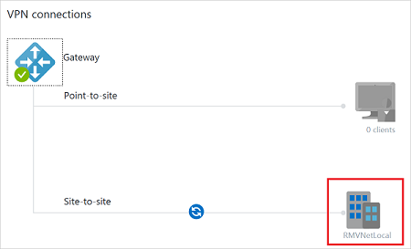
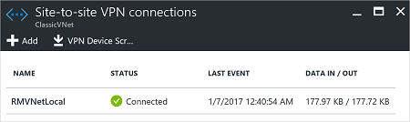
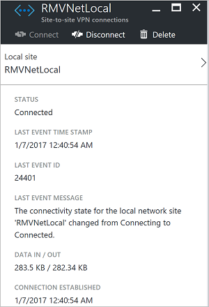

In the Azure portal, you can view the connection status for a classic VNet VPN Gateway by navigating to the connection. The following steps show one way to navigate to your connection and verify.

1. In the [Azure portal](https://portal.azure.com), click **All resources** and navigate to your classic virtual network.
2. On the virtual network blade, click **Overview** to access the **VPN connections** section of the blade.
3. On the VPN connections graphic, click the site.

	
4. On the **Site-to-site VPN connections** blade, view the information about your site.

	
5. To view more information about the connection, click the name of the connection to open the **Site-to-site VPN Connection** blade.

	
