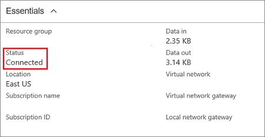

In the Azure portal, you can view the connection status of a Resource Manager VPN Gateway by navigating to the connection. The following steps show one way to navigate to your connection and verify.

1. In the [Azure portal](https://portal.azure.com), click **All resources** and navigate to your virtual network gateway.
2. On the blade for your virtual network gateway, click **Connections**. You can see the status of each connection.
3. Click the name of the connection that you want to verify to open **Essentials**. In Essentials, you can view more information about your connection. The **Status** is 'Succeeded' and 'Connected' when you have made a successful connection.

   
