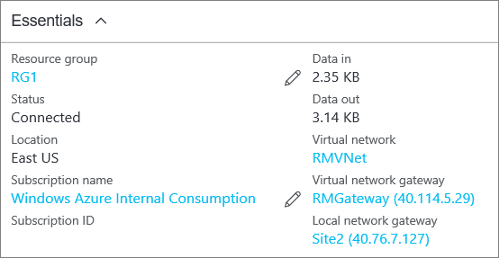

### To verify your connection by using PowerShell

You can verify that your connection succeeded by using the 'Get-AzureRmVirtualNetworkGatewayConnection' cmdlet, with or without '-Debug'. 

1. Use the following cmdlet example, configuring the values to match your own. If prompted, select 'A' in order to run 'All'. In the example, '-Name' refers to the name of the connection that you created and want to test.

  ```powershell
  Get-AzureRmVirtualNetworkGatewayConnection -Name MyGWConnection -ResourceGroupName MyRG
  ```
2. After the cmdlet has finished, view the values. In the example below, the connection status shows as 'Connected' and you can see ingress and egress bytes.

  ```
  "connectionType": "IPsec",
  "routingWeight": 10,
  "sharedKey": "abc123",
  "connectionStatus": "Connected",
  "ingressBytesTransferred": 33509044,
  "egressBytesTransferred": 4142431
  ```

### To verify your connection by using the Azure portal

In the Azure portal, you can view the connection status by navigating to the connection. There are multiple ways to do this. The following steps show one way to navigate to your connection and verify.

1. In the [Azure portal](http://portal.azure.com), click **All resources** and navigate to your virtual network gateway.
2. On the blade for your virtual network gateway, click **Connections**. You can see the status of each connection.
3. Click the name of the connection that you want to verify to open **Essentials**. In Essentials, you can view more information about your connection. The **Status** is 'Succeeded' and 'Connected' when you have made a successful connection.
   
    