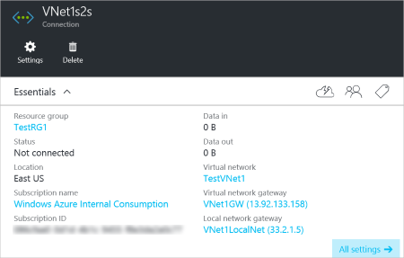

### To verify your connection by using PowerShell

You can verify that your connection succeeded by using the 'Get-AzureRmVirtualNetworkGatewayConnection' cmdlet, with or without -Debug. 

1. Use the following cmdlet example, configuring the values to match your own. If prompted, select 'A' in order to run 'All'. In the example, -Name refers to the name of the connection that you created and want to test.

		Get-AzureRmVirtualNetworkGatewayConnection -Name localtovon -ResourceGroupName testrg

2. After the cmdlet has finished, view the values. In the example below, the connection status shows as 'Connected' and you can see ingress and egress bytes.

		Body:
		{
		  "name": "localtovon",
		  "id":
		"/subscriptions/086cfaa0-0d1d-4b1c-94544-f8e3da2a0c7789/resourceGroups/testrg/providers/Microsoft.Network/connections/loca
		ltovon",
		  "properties": {
		    "provisioningState": "Succeeded",
		    "resourceGuid": "1c484f82-23ec-47e2-8cd8-231107450446b",
		    "virtualNetworkGateway1": {
		      "id":
		"/subscriptions/086cfaa0-0d1d-4b1c-94544-f8e3da2a0c7789/resourceGroups/testrg/providers/Microsoft.Network/virtualNetworkGa
		teways/vnetgw1"
		    },
		    "localNetworkGateway2": {
		      "id":
		"/subscriptions/086cfaa0-0d1d-4b1c-94544-f8e3da2a0c7789/resourceGroups/testrg/providers/Microsoft.Network/localNetworkGate
		ways/LocalSite"
		    },
		    "connectionType": "IPsec",
		    "routingWeight": 10,
		    "sharedKey": "abc123",
		    "connectionStatus": "Connected",
		    "ingressBytesTransferred": 33509044,
		    "egressBytesTransferred": 4142431
		  }

### To verify your connection by using the Azure portal

In the Azure portal, you can view the connection status by navigating to the connection. There are multiple ways to do this. Below is one way to navigate to your connection.

1. In the [Azure portal](http://portal.azure.com), navigate to **Virtual network gateways**. Click your gateway name.
2. In the pane, under **Settings**, click **Connections**. You can see the status of each connection.
3. For more information about the connection, click the name of the connection. In the Essentials page for your connection, pay attention to the **Connection Status**. The status will be 'Succeeded' and 'Connected' when you have made a successful connection. You can check the data flowing through by looking at **Data in** and **Data out**.

	In the example below, the **Connection Status** is 'Not connected'. 

	