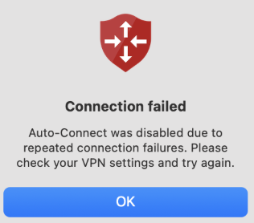
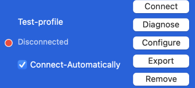

> [!NOTE]
> Note the following prerequisites for Always On VPN device tunnels on macOS:
> - The Azure VPN Client for macOS must be version 3.0.100 or later.
> - Always On must be configured per profile - there's no default Always On profile.
> - Only one profile can have Always On enabled at a time.
> - Always On can only be enabled when the VPN connection is disconnected. It is grayed out in any other state.
> - Disconnecting an Always On profile disables the Always On feature for that profile.

1. Open the Azure VPN Client for macOS.
1. Select the profile you want to configure for Always On. If there isn't a client profile downloaded, follow the steps in **[this document](../articles/vpn-gateway/vpn-gateway-howto-always-on-device-tunnel-macos.md)** to configure a profile for your VPN client.
1. Ensure the connection is in disconnected mode.
1. Select the checkbox for **Connect-Automatically**. 
1. If the connection succeeds, you successfully configured an Always On device tunnel. 

## Troubleshooting Always On VPN
### Connection failed - Repeated connection failures

Always on was disabled because connection can't be established even after max retry attempts. It could mean gateway isn’t reachable, incorrect connection configuration, etc. Admins should check the VPN configuration, validate gateway is up, and then try to re-enable connect-automatically. 

### Always On Checkbox enabled but connection remains disconnected

Some unexpected error was hit. Try one of these mitigations: 
- Disable and re-enable 'Connect Automatically'
- Remove profile and then import again 
