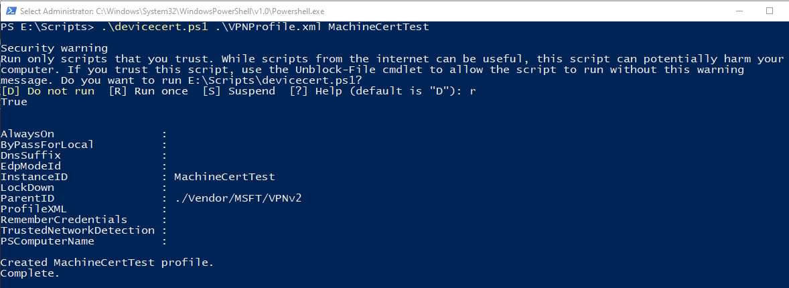

The following requirements must be met in order to successfully establish a device tunnel:

* The device must be a domain joined computer running Windows 10 Enterprise or Education version 1809 or later.
* The tunnel is only configurable for the Windows built-in VPN solution and is established using IKEv2 with computer certificate authentication.
* Only one device tunnel can be configured per device.

1. Install client certificates on the Windows 10 or later client using the [point-to-site VPN client](../articles/vpn-gateway/point-to-site-how-to-vpn-client-install-azure-cert.md) article. The certificate needs to be in the Local Machine store.
1. Create a VPN Profile and configure device tunnel in the context of the LOCAL SYSTEM account using [these instructions](/windows-server/remote/remote-access/vpn/vpn-device-tunnel-config#vpn-device-tunnel-configuration).

### Configuration example for device tunnel

After you have configured the virtual network gateway and installed the client certificate in the Local Machine store on the Windows 10 or later client, use the following examples to configure a client device tunnel:

1. Copy the following text and save it as ***devicecert.ps1***.

   ```
   Param(
   [string]$xmlFilePath,
   [string]$ProfileName
   )

   $a = Test-Path $xmlFilePath
   echo $a

   $ProfileXML = Get-Content $xmlFilePath

   echo $XML

   $ProfileNameEscaped = $ProfileName -replace ' ', '%20'

   $Version = 201606090004

   $ProfileXML = $ProfileXML -replace '<', '&lt;'
   $ProfileXML = $ProfileXML -replace '>', '&gt;'
   $ProfileXML = $ProfileXML -replace '"', '&quot;'

   $nodeCSPURI = './Vendor/MSFT/VPNv2'
   $namespaceName = "root\cimv2\mdm\dmmap"
   $className = "MDM_VPNv2_01"

   $session = New-CimSession

   try
   {
   $newInstance = New-Object Microsoft.Management.Infrastructure.CimInstance $className, $namespaceName
   $property = [Microsoft.Management.Infrastructure.CimProperty]::Create("ParentID", "$nodeCSPURI", 'String', 'Key')
   $newInstance.CimInstanceProperties.Add($property)
   $property = [Microsoft.Management.Infrastructure.CimProperty]::Create("InstanceID", "$ProfileNameEscaped", 'String', 'Key')
   $newInstance.CimInstanceProperties.Add($property)
   $property = [Microsoft.Management.Infrastructure.CimProperty]::Create("ProfileXML", "$ProfileXML", 'String', 'Property')
   $newInstance.CimInstanceProperties.Add($property)

   $session.CreateInstance($namespaceName, $newInstance)
   $Message = "Created $ProfileName profile."
   Write-Host "$Message"
   }
   catch [Exception]
   {
   $Message = "Unable to create $ProfileName profile: $_"
   Write-Host "$Message"
   exit
   }
   $Message = "Complete."
   Write-Host "$Message"
   ```
1. Copy the following text and save it as ***VPNProfile.xml*** in the same folder as **devicecert.ps1**. Edit the following text to match your environment.

   * `<Servers>azuregateway-1234-56-78dc.cloudapp.net</Servers> <= Can be found in the VpnSettings.xml in the downloaded profile zip file`
   * `<Address>192.168.3.5</Address> <= IP of resource in the vnet or the vnet address space`
   * `<Address>192.168.3.4</Address> <= IP of resource in the vnet or the vnet address space`

   ```
   <VPNProfile>  
     <NativeProfile>  
   <Servers>azuregateway-1234-56-78dc.cloudapp.net</Servers>  
   <NativeProtocolType>IKEv2</NativeProtocolType>  
   <Authentication>  
     <MachineMethod>Certificate</MachineMethod>  
   </Authentication>  
   <RoutingPolicyType>SplitTunnel</RoutingPolicyType>  
    <!-- disable the addition of a class based route for the assigned IP address on the VPN interface -->
   <DisableClassBasedDefaultRoute>true</DisableClassBasedDefaultRoute>  
     </NativeProfile> 
     <!-- use host routes(/32) to prevent routing conflicts -->  
     <Route>  
   <Address>192.168.3.5</Address>  
   <PrefixSize>32</PrefixSize>  
     </Route>  
     <Route>  
   <Address>192.168.3.4</Address>  
   <PrefixSize>32</PrefixSize>  
     </Route>  
   <!-- need to specify always on = true --> 
     <AlwaysOn>true</AlwaysOn> 
   <!-- new node to specify that this is a device tunnel -->  
    <DeviceTunnel>true</DeviceTunnel>
   <!--new node to register client IP address in DNS to enable manage out -->
   <RegisterDNS>true</RegisterDNS>
   </VPNProfile>
   ```
1. Download **PsExec** from [Sysinternals](/sysinternals/downloads/psexec) and extract the files to **C:\PSTools**.
1. From an Admin CMD prompt, launch PowerShell by running:
   
   For 32-bit Windows:
   
   ```
   PsExec.exe -s -i powershell
   ```
   
   For 64-bit Windows:
   
   ```
   PsExec64.exe -s -i powershell
   ```

   
1. In PowerShell, switch to the folder where **devicecert.ps1** and **VPNProfile.xml** are located, and run the following command:

   ```powershell
   .\devicecert.ps1 .\VPNProfile.xml MachineCertTest
   ```
   
   
1. Run **rasphone**.

   
1. Look for the **MachineCertTest** entry and click **Connect**.

   
1. If the connection succeeds, reboot the computer. The tunnel will connect automatically.
