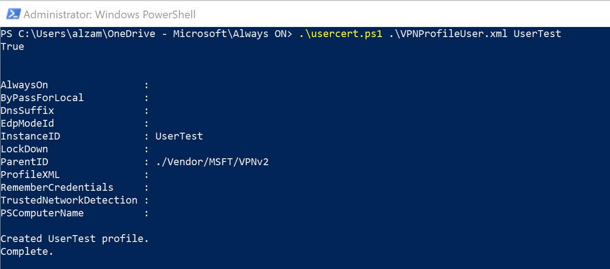

1. Install client certificates on the Windows client, as shown in this [point-to-site VPN client](../articles/vpn-gateway/point-to-site-how-to-vpn-client-install-azure-cert.md) article. The certificate must be in the current user store.

1. You can configure the Always On VPN client through PowerShell, Configuration Manager, or Intune by following the instructions in [Configure Windows 10 or later client Always On VPN connections](/windows-server/remote/remote-access/vpn/always-on-vpn/deploy/vpn-deploy-client-vpn-connections).

### Example configuration for the user tunnel

After you've configured the virtual network gateway and installed the client certificate in the local machine store on the Windows client, configure a client device tunnel by using the following examples. Note that these examples have been validated on Windows 10.

1. Copy the following text, and save it as *usercert.ps1*:

   ```
   Param(
   [string]$xmlFilePath,
   [string]$ProfileName
   )

   $a = Test-Path $xmlFilePath
   echo $a

   $ProfileXML = Get-Content $xmlFilePath

   echo $XML

   $ProfileNameEscaped = $ProfileName -replace ' ', '%20'

   $Version = 201606090004

   $ProfileXML = $ProfileXML -replace '<', '&lt;'
   $ProfileXML = $ProfileXML -replace '>', '&gt;'
   $ProfileXML = $ProfileXML -replace '"', '&quot;'

   $nodeCSPURI = './Vendor/MSFT/VPNv2'
   $namespaceName = "root\cimv2\mdm\dmmap"
   $className = "MDM_VPNv2_01"

   $session = New-CimSession

   try
   {
   $newInstance = New-Object Microsoft.Management.Infrastructure.CimInstance $className, $namespaceName
   $property = [Microsoft.Management.Infrastructure.CimProperty]::Create("ParentID", "$nodeCSPURI", 'String', 'Key')
   $newInstance.CimInstanceProperties.Add($property)
   $property = [Microsoft.Management.Infrastructure.CimProperty]::Create("InstanceID", "$ProfileNameEscaped", 'String', 'Key')
   $newInstance.CimInstanceProperties.Add($property)
   $property = [Microsoft.Management.Infrastructure.CimProperty]::Create("ProfileXML", "$ProfileXML", 'String', 'Property')
   $newInstance.CimInstanceProperties.Add($property)

   $session.CreateInstance($namespaceName, $newInstance)
   $Message = "Created $ProfileName profile."
   Write-Host "$Message"
   }
   catch [Exception]
   {
   $Message = "Unable to create $ProfileName profile: $_"
   Write-Host "$Message"
   exit
   }
   $Message = "Complete."
   Write-Host "$Message"
   ```
1. Copy the following text, and save it as *VPNProfile.xml* in the same folder as *usercert.ps1*. Edit the following text to match your environment:

   * `<Servers>azuregateway-1234-56-78dc.cloudapp.net</Servers>  <= Can be found in the VpnSettings.xml in the downloaded profile zip file`
   * `<Address>192.168.3.5</Address>  <= IP of resource in the vnet or the vnet address space`
   * `<Address>192.168.3.4</Address>  <= IP of resource in the vnet or the vnet address space`
   * `<PrefixSize>32</PrefixSize>     <= Subnet mask`

   ```
    <VPNProfile>  
      <NativeProfile>  
    <Servers>azuregateway-b115055e-0882-49bc-a9b9-7de45cba12c0-8e6946892333.vpn.azure.com</Servers>  
    <NativeProtocolType>IKEv2</NativeProtocolType>  
    <Authentication>  
    <UserMethod>Eap</UserMethod>
    <Eap>
    <Configuration>
    <EapHostConfig xmlns="http://www.microsoft.com/provisioning/EapHostConfig"><EapMethod><Type xmlns="http://www.microsoft.com/provisioning/EapCommon">13</Type><VendorId xmlns="http://www.microsoft.com/provisioning/EapCommon">0</VendorId><VendorType xmlns="http://www.microsoft.com/provisioning/EapCommon">0</VendorType><AuthorId xmlns="http://www.microsoft.com/provisioning/EapCommon">0</AuthorId></EapMethod><Config xmlns="http://www.microsoft.com/provisioning/EapHostConfig"><Eap xmlns="http://www.microsoft.com/provisioning/BaseEapConnectionPropertiesV1"><Type>13</Type><EapType xmlns="http://www.microsoft.com/provisioning/EapTlsConnectionPropertiesV1"><CredentialsSource><CertificateStore><SimpleCertSelection>true</SimpleCertSelection></CertificateStore></CredentialsSource><ServerValidation><DisableUserPromptForServerValidation>false</DisableUserPromptForServerValidation><ServerNames></ServerNames></ServerValidation><DifferentUsername>false</DifferentUsername><PerformServerValidation xmlns="http://www.microsoft.com/provisioning/EapTlsConnectionPropertiesV2">false</PerformServerValidation><AcceptServerName xmlns="http://www.microsoft.com/provisioning/EapTlsConnectionPropertiesV2">false</AcceptServerName></EapType></Eap></Config></EapHostConfig>
    </Configuration>
    </Eap>
    </Authentication>  
    <RoutingPolicyType>SplitTunnel</RoutingPolicyType>  
     <!-- disable the addition of a class based route for the assigned IP address on the VPN interface -->
    <DisableClassBasedDefaultRoute>true</DisableClassBasedDefaultRoute>  
      </NativeProfile> 
      <!-- use host routes(/32) to prevent routing conflicts -->  
      <Route>  
    <Address>192.168.3.5</Address>  
    <PrefixSize>32</PrefixSize>  
      </Route>  
      <Route>  
    <Address>192.168.3.4</Address>  
    <PrefixSize>32</PrefixSize>  
      </Route>  
    <!-- traffic filters for the routes specified above so that only this traffic can go over the device tunnel --> 
      <TrafficFilter>  
    <RemoteAddressRanges>192.168.3.4, 192.168.3.5</RemoteAddressRanges>  
      </TrafficFilter>
    <!-- need to specify always on = true --> 
    <AlwaysOn>true</AlwaysOn>
    <RememberCredentials>true</RememberCredentials>
    <!--new node to register client IP address in DNS to enable manage out -->
    <RegisterDNS>true</RegisterDNS>
    </VPNProfile>
   ```
1. Run PowerShell as an administrator.

1. In PowerShell, switch to the folder where *usercert.ps1* and *VPNProfile.xml* are located, and run the following command:

   ```powershell
   C:\> .\usercert.ps1 .\VPNProfile.xml UserTest
   ```
   
   
1. Under **VPN Settings**, look for the **UserTest** entry, and then select **Connect**.

1. If the connection succeeds, you've successfully configured an Always On user tunnel.