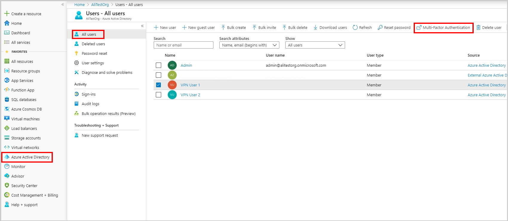
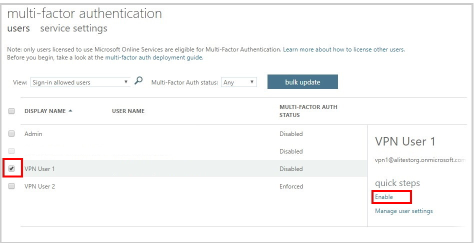

### Open the MFA page

1. Sign in to the Azure portal.
2. Navigate to **Microsoft Entra ID -> All users**.
3. Select **Multi-Factor Authentication** to open the multi-factor authentication page.

   

###  Select users

1. On the **multi-factor authentication** page, select the user(s) for whom you want to enable MFA.
2. Select **Enable**.

   
