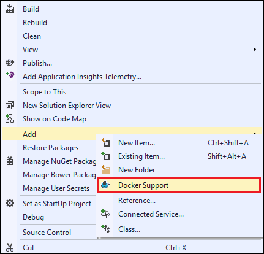
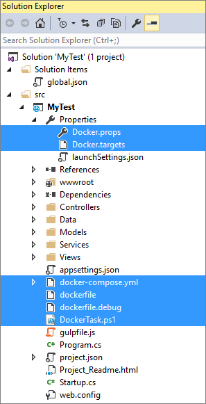

1. In the Visual Studio **Solution Explorer**, right-click the project and select **Add > Docker Support** from the context menu.

    

1. Adding Docker support to an ASP.NET 5 web project results in the addition of several Docker-related
files being added to the project, including Docker-Compose files, deployment Windows PowerShell scripts, and Docker property files. 

    
    
> [AZURE.NOTE] If using the [Docker for Windows Beta](https://beta.docker.com), open Properties\Docker.props, remove the default value
> and restart Visual Studio for the value to take effect.
> 
> ```
> <DockerMachineName Condition="'$(DockerMachineName)'=="></DockerMachineName>
> ```
