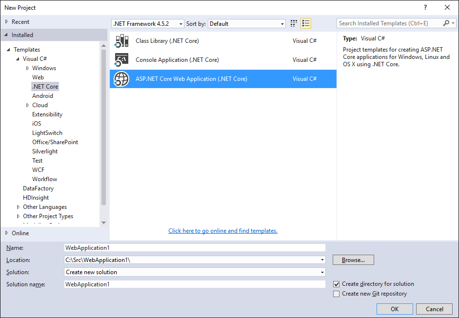
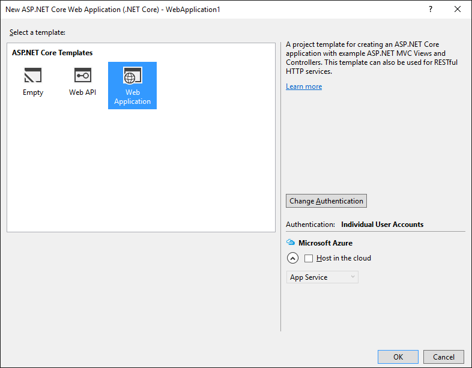

1. From the Visual Studio menu, select **File > New > Project**. 

1. Under the **Templates** section of the **New Project** dialog box, select **Visual C# > .NET Core**.

1. Select **ASP.NET Core Web Application (.NET Core)**.
	

1. Give your new application a name (or take the default) and Tap **OK**.  

1. Under **ASP.NET Core Templates**, select **.NET Core**.
	

1. Deselect **Host in the cloud** as you'll be using Docker as your deployment solution.

