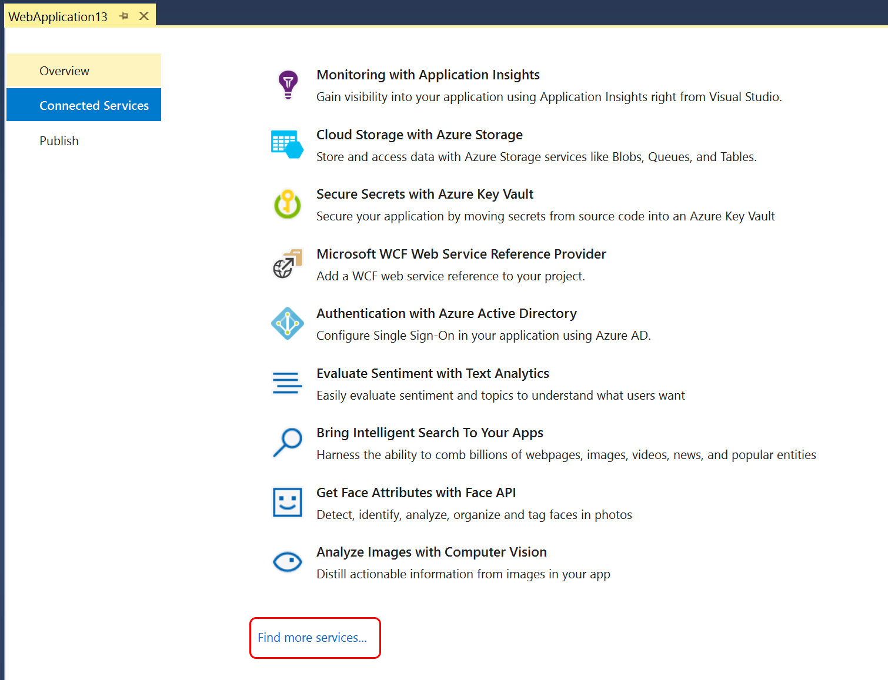
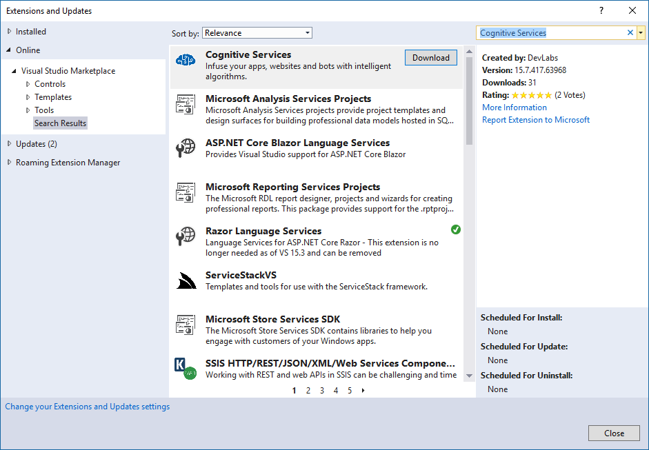

## Install the Cognitive Services VSIX Extension

1. With your web project open in Visual Studio, choose the **Connected Services** tab. The tab is available on the welcome page that appears when you open a new project. If you don't see the tab, select **Connected Services** in your project in Solution Explorer.

   

1. Scroll down to the bottom of the list of services, and select **Find more services**.

    
 
    The **Extensions and Updates** dialog box appears.

1. In the **Extensions and Updates** dialog box, search for **Cognitive Services**, and then download and install the Cognitive Services VSIX package.

   

   Installing an extension requires a restart of the integrated development environment (IDE).

2. Restart Visual Studio. The extension installs when you close Visual Studio, and is available next time you launch the IDE.

