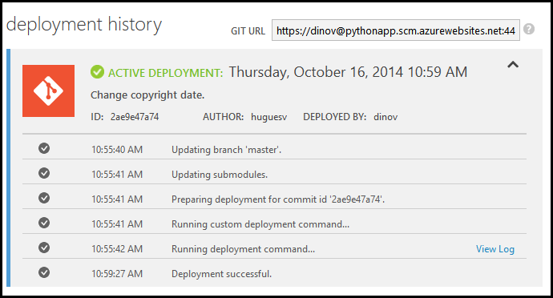
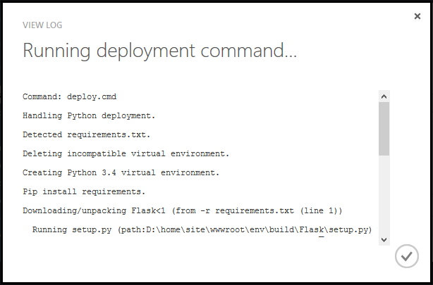

If you need to review the deployment output, including the custom deployment script output, navigate to the  **DEPLOYMENTS** page on the Azure portal.

Expand the desired deployment:

Click on **View Log** to see the output of the custom deployment script:

